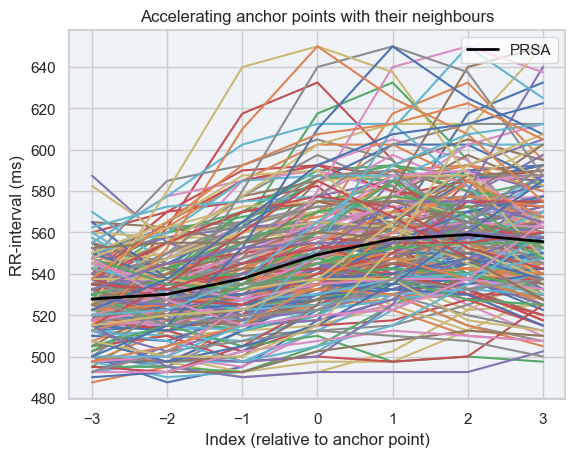
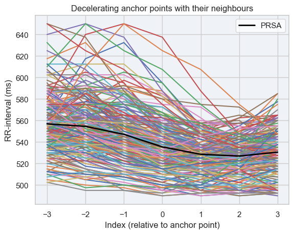

## Project AUTOMATIC
Project "AUTOMATIC: Analysis of the relationship between the AUTOnoMic nervous system and cerebral AutoregulaTion using maChine learning approach" is financed by grant SONATA-18 National Science Center (UMO-2022/47/D/ST7/00229)

This project aims to fill a gap in the methodology of analysing the temporal correlation between cerebral autoregulation and ANS taking into account the dynamic of this association. The main goals of the project can be summarised as follows:

Aim 1. Clear-cut experimental evidence of the character of the association between autonomic response variables and cerebral autoregulation in healthy volunteers.

Aim 2. The characteristic of the contemporaneous relationship between autonomic response variables and cerebral autoregulation using an adaptation of advanced time-series data analysis methods.

Aim 3. A robust understanding of how cerebral autoregulation and ANS are interconnected in patients with intracranial pathologies

<a href=https://www.linkedin.com/company/automatic-ca-and-ans-using-ml/about/>Project official LinkedIn profile</a>

## Aim of the repository
The aim of this repository is to provide the code for phase rectified signal averaging (PRSA) and to applay it to the data from the project AUTOMATIC. The code is divided into two parts:
1. prep.py - specific to our data preprocessing, and displaying its properties
2. prsa.py - all functions for calculating and displaying PRSA
3. peaks_detection.py - functions for detecting and displaying found peaks in the signal and creating rr-signal

## Data
The data used in this project is not public. It comes from healthy volunteers aged 20-25 years old.

## Algorithm
The algorithm of PRSA is based on the following steps:

1. Filtering signal using biosppy library

2. Finding peaks in the sygnal by calculating its similarity to the given filter and taking values above threshold

3. Creating rr signal from time difference between the peaks

4. Finding accelerating and decelerating anchor points in the signal

5. Calcultaing AC and DC component of the corresponding averaged signal using following formula: AC and DC = [RR(0) + RR(1) - RR(-1) - RR(-2)]/4

  
   

